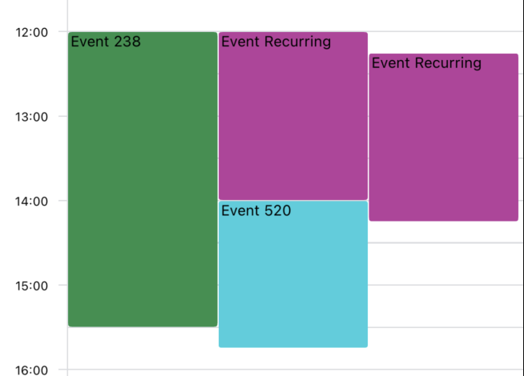
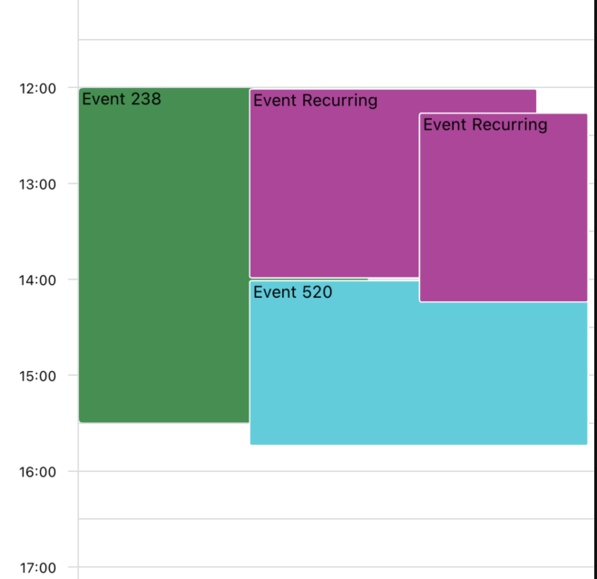

# Overlap Handling

React Native Calendar Kit provides options for handling overlapping events. You can control this behavior using the `overlapType` prop on the `CalendarKit` component.

### overlapType

The `overlapType` prop determines how overlapping events are displayed. It accepts one of the following string values:

- `'no-overlap'` (default): Events that overlap in time are displayed side by side without overlapping visually.
- `'overlap'`: Events are allowed to overlap visually, potentially stacking on top of each other.

Example usage:

```tsx
<CalendarKit
    events={events}
    overlapType="overlap"
    // ... other props
/>
```

#### No-overlap Mode



In no-overlap mode:
- Events that occur at the same time are positioned side by side.
- Each event takes up an equal portion of the column width.
- This mode ensures all events are fully visible without any overlapping.

#### Overlap Mode



In overlap mode:
- Events are allowed to visually overlap when they occur at the same time.
- This can be useful for displaying dense schedules or when you want to emphasize time conflicts.

### Additional Configuration

You can further customize the appearance of events using these related props:

- `rightEdgeSpacing`: Controls the space (in pixels) reserved on the right edge of each day column. Default is 1.
- `overlapEventsSpacing`: Sets the spacing (in pixels) between events. Default is 1. (no-overlap mode)
- `minStartDifference`: Defines the minimum start time difference (in minutes) for events to be considered overlapping. Default is 30 minutes. (overlap mode)

Example:

```tsx
<CalendarContainer
    events={events}
    overlapType="overlap"
    rightEdgeSpacing={1}
    minStartDifference={15}
    // ... other props
>
    <CalendarHeader />
    <CalendarBody />
</CalendarContainer>
```
